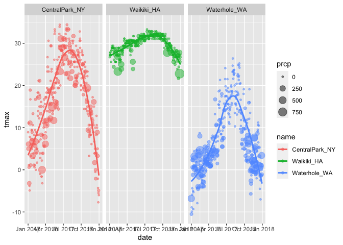

Visualization
================

## Scatterplots

Create a scatterplot

``` r
ggplot(weather_df, aes(x = tmin, y = tmax)) + 
  geom_point()
```

    ## Warning: Removed 15 rows containing missing values (geom_point).

<!-- -->

Name approach, same plot - using the " %\>% " pipe function

``` r
weather_df %>% 
  ggplot(aes(x = tmin, y = tmax)) + 
  geom_point()
```

    ## Warning: Removed 15 rows containing missing values (geom_point).

<!-- -->

Save and edit plot object.

``` r
#saving my ggplot "frame" into an object I can then manipulate later on
weather_plot = 
  weather_df %>% 
  ggplot(aes(x = tmin, y = tmax))

#manipulating the ggplot object I created
weather_plot + geom_point()
```

    ## Warning: Removed 15 rows containing missing values (geom_point).

<!-- -->

## Advanced scatterplot

``` r
weather_df %>% 
  ggplot(aes(x = tmin, y = tmax, color = name)) + 
  geom_point() + 
  geom_smooth(se = FALSE)
```

    ## `geom_smooth()` using method = 'loess' and formula 'y ~ x'

    ## Warning: Removed 15 rows containing non-finite values (stat_smooth).

    ## Warning: Removed 15 rows containing missing values (geom_point).

<!-- -->

## what about `aes` placement .. ?

``` r
weather_df %>% 
  ggplot(aes(x = tmin, y = tmax)) + 
  geom_point(aes(color = name)) + 
  geom_smooth(se = T)
```

    ## `geom_smooth()` using method = 'gam' and formula 'y ~ s(x, bs = "cs")'

    ## Warning: Removed 15 rows containing non-finite values (stat_smooth).

    ## Warning: Removed 15 rows containing missing values (geom_point).

<!-- -->

Let’s facet some things\!

``` r
weather_df %>% 
  ggplot(aes(x = tmin, y = tmax, alpha = tmin, color = name)) + 
  geom_point(alpha = .2) + 
  geom_smooth(se = T) + 
  facet_grid(. ~ name) 
```

    ## `geom_smooth()` using method = 'loess' and formula 'y ~ x'

    ## Warning: Removed 15 rows containing non-finite values (stat_smooth).

    ## Warning: Removed 15 rows containing missing values (geom_point).

<!-- -->

Let’s combine some elements and try a new plot.

``` r
weather_df %>% 
  ggplot(aes(x = date, y = tmax, color = name)) +
  geom_point(aes(size = prcp), alpha = .5) + 
  geom_smooth(se = F) + 
  facet_grid(. ~ name)
```

    ## `geom_smooth()` using method = 'loess' and formula 'y ~ x'

    ## Warning: Removed 3 rows containing non-finite values (stat_smooth).

    ## Warning: Removed 3 rows containing missing values (geom_point).

<!-- -->

## Some small notes

How many geoms do you need? You can have whatever geoms you want

``` r
weather_df %>% 
  ggplot(aes(x = tmin, y = tmax, color = name)) + 
  geom_smooth(se = T)
```

    ## `geom_smooth()` using method = 'loess' and formula 'y ~ x'

    ## Warning: Removed 15 rows containing non-finite values (stat_smooth).

<!-- -->

You can use a neat geom\!

``` r
#hexagons
weather_df %>% 
  ggplot(aes(x= tmin, y = tmax)) + 
  geom_hex() 
```

    ## Warning: Removed 15 rows containing non-finite values (stat_binhex).

<!-- -->

``` r
#squares
weather_df %>% 
  ggplot(aes(x= tmin, y = tmax)) + 
  geom_bin2d()
```

    ## Warning: Removed 15 rows containing non-finite values (stat_bin2d).

<!-- -->

``` r
#contours
weather_df %>% 
  ggplot(aes(x= tmin, y = tmax)) + 
  geom_density2d() + 
  geom_point(alpha = .3)
```

    ## Warning: Removed 15 rows containing non-finite values (stat_density2d).

    ## Warning: Removed 15 rows containing missing values (geom_point).

<!-- -->

## Univariate Plots

Where you have just one variable

HISTOGRAMS

``` r
weather_df %>% 
  ggplot(aes(x = tmin)) + 
  geom_histogram() 
```

    ## `stat_bin()` using `bins = 30`. Pick better value with `binwidth`.

    ## Warning: Removed 15 rows containing non-finite values (stat_bin).

<!-- -->

Can we add color to the ^ histogram … ?

``` r
weather_df %>% 
  ggplot(aes(x = tmin, color = name)) + 
  geom_histogram(position = "dodge")
```

    ## `stat_bin()` using `bins = 30`. Pick better value with `binwidth`.

    ## Warning: Removed 15 rows containing non-finite values (stat_bin).

<!-- -->

``` r
#color vs fill in aes()
weather_df %>% 
  ggplot(aes(x = tmin, fill = name)) + 
  geom_histogram(position = "dodge")
```

    ## `stat_bin()` using `bins = 30`. Pick better value with `binwidth`.

    ## Warning: Removed 15 rows containing non-finite values (stat_bin).

<!-- -->

``` r
#faceting as opposed to having all 3 distbs in one plot
weather_df %>% 
  ggplot(aes(x = tmin, fill = name)) + 
  geom_histogram() + 
  facet_grid(. ~ name)
```

    ## `stat_bin()` using `bins = 30`. Pick better value with `binwidth`.

    ## Warning: Removed 15 rows containing non-finite values (stat_bin).

<!-- -->

In the above histograms, it’s quite hard to compare one histogram with
another. So, we’re going to use a different geom to be able to compare
multiple histograms of multiple variables

``` r
weather_df %>% 
  ggplot(aes(x = tmin, fill = name)) + 
  geom_density(alpha = .3)
```

    ## Warning: Removed 15 rows containing non-finite values (stat_density).

<!-- -->

``` r
#with `adjust`
weather_df %>% 
  ggplot(aes(x = tmin, fill = name)) + 
  geom_density(alpha = .3, adjust = .5)
```

    ## Warning: Removed 15 rows containing non-finite values (stat_density).

<!-- -->

On `density` in `geom_density` You can think of density in
`geom_density` as a histogram that has had it individual points smoothed
out. An argument FOR geom\_density is that it makes it easier to compare
histograms. But note how you lost some information compared to
geom\_histogram, which give you a more detailed description of your
histogram. You can try and address by passing the `adjsut =` argument in
the geom\_density funciton.

## Box Plots

``` r
weather_df %>% 
  ggplot(aes(x = name, y = tmin)) + 
  geom_boxplot()
```

    ## Warning: Removed 15 rows containing non-finite values (stat_boxplot).

<!-- -->

## Trendy plots

Other univariate plots

1st up - violin plots (nvm they don’t quite look like violins) argument
for `geom_violin` is tha they convey some more information, as a
graphic, on the distribution. Taht’s to say, it’s easier to tell whether
something is left skewed/right skewed/symmterical. Think of violin plots
as a cross between histograms and density plots. Also note how violin
plots are symmterical around the y-axis … they’re really just histograms
that mirror eachother. Argument against violin plot in contrast to
box\_plots is that they don’t give you a direct info on, say, the
median. But you can address this by adding whaterver statistics you need
using `stat_summary(fun = "median")`

``` r
weather_df %>% 
  ggplot(aes(x = name, y = tmin, fill = name)) + 
  geom_violin(alpha = .5) + 
  stat_summary(fun = "median")
```

    ## Warning: Removed 15 rows containing non-finite values (stat_ydensity).

    ## Warning: Removed 15 rows containing non-finite values (stat_summary).

    ## Warning: Removed 3 rows containing missing values (geom_segment).

<!-- -->

Trendy plots part II - Ridge Plots (most popular plot of 2017)

``` r
weather_df %>% 
  ggplot(aes(x = tmin, y = name, fill = name)) + 
  geom_density_ridges()
```

    ## Picking joint bandwidth of 1.67

    ## Warning: Removed 15 rows containing non-finite values (stat_density_ridges).

<!-- -->
