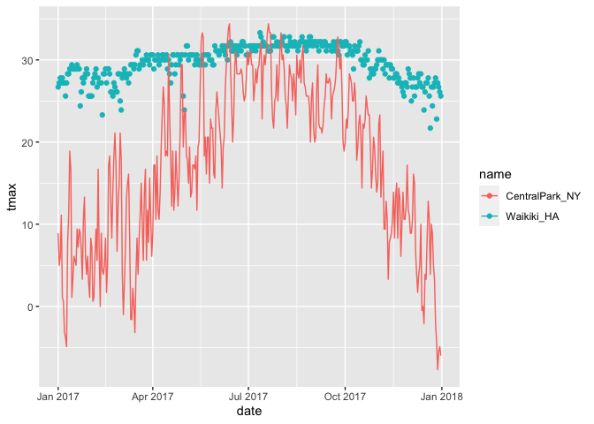

Visualization
================

## Load weather data

## Recall this plot …

``` r
weather_df %>% 
  ggplot(aes(x = tmin, y = tmax, color = name)) + 
  geom_point(alpha = .5)
```

    ## Warning: Removed 15 rows containing missing values (geom_point).

<!-- -->

## Labels

``` r
weather_df %>% 
  ggplot(aes(x = tmin, y = tmax, color = name)) + 
  geom_point(alpha = .5) + 
  labs(
    title = "Temperature plot", 
    x = "Minimum daily temperature (C)",
    Y = "Minimum daily temperature (C)",
    caption = "Data from rnoaa package; temperatures in 2017"
  )
```

    ## Warning: Removed 15 rows containing missing values (geom_point).

<!-- -->

## scales

Start with the same plot; x and y scales

``` r
weather_df %>% 
  ggplot(aes(x = tmin, y = tmax, color = name)) + 
  geom_point(alpha = .5) + 
  labs(
    title = "Temperature plot", 
    x = "Minimum daily temperature (C)",
    Y = "Minimum daily temperature (C)",
    caption = "Data from rnoaa package; temperatures in 2017"
  ) + 
  scale_x_continuous(
    breaks = c(-15, 0, 15), 
    labels = c("-15 ˚C", "O ˚C","15 ˚C")
  ) + 
  scale_y_continuous(
    #trans = "sqrt"
   # trans = "log"
    position = "right"
  )
```

    ## Warning: Removed 15 rows containing missing values (geom_point).

<!-- -->

Look at other scales

``` r
weather_df %>% 
  ggplot(aes(x = tmin, y = tmax, color = name)) + 
  geom_point(alpha = .5) + 
  labs(
    title = "Temperature plot", 
    x = "Minimum daily temperature (C)",
    Y = "Minimum daily temperature (C)",
    caption = "Data from rnoaa package; temperatures in 2017"
  ) +
  scale_color_hue(
    name = "Location",
    h = c(100, 800)
    )
```

    ## Warning: Removed 15 rows containing missing values (geom_point).

<!-- -->

And if you don’t want to deal with choosing your own colors Using the
`viridis` package

``` r
weather_df %>% 
  ggplot(aes(x = tmin, y = tmax, color = name)) + 
  geom_point(alpha = .5) + 
  labs(
    title = "Temperature plot", 
    x = "Minimum daily temperature (C)",
    Y = "Minimum daily temperature (C)",
    caption = "Data from rnoaa package; temperatures in 2017"
  ) + 
  viridis::scale_color_viridis(
  name = "Location", 
  discrete = TRUE)
```

    ## Warning: Removed 15 rows containing missing values (geom_point).

<!-- -->

## Themes

Shift the legend

``` r
weather_df %>% 
  ggplot(aes(x = tmin, y = tmax, color = name)) + 
  geom_point(alpha = .5) + 
  labs(
    title = "Temperature plot", 
    x = "Minimum daily temperature (C)",
    Y = "Minimum daily temperature (C)",
    caption = "Data from rnoaa package; temperatures in 2017"
  ) + 
  viridis::scale_color_viridis(
  name = "Location", 
  discrete = TRUE) + 
  theme(legend.position = "bottom")
```

    ## Warning: Removed 15 rows containing missing values (geom_point).

<!-- -->

Change the overall theme.

``` r
weather_df %>% 
  ggplot(aes(x = tmin, y = tmax, color = name)) + 
  geom_point(alpha = .5) + 
  labs(
    title = "Temperature plot", 
    x = "Minimum daily temperature (C)",
    Y = "Minimum daily temperature (C)",
    caption = "Data from rnoaa package; temperatures in 2017"
  ) + 
  viridis::scale_color_viridis(
  name = "Location", 
  discrete = TRUE) + 
  #theme_bw() ##options for overall themes
  #theme_classic()
  #ggthemes::theme_economist()
  #ggthemes::theme_excel()
   theme_minimal() + 
  theme(legend.position = "bottom")
```

    ## Warning: Removed 15 rows containing missing values (geom_point).

<!-- -->

Setting options

``` r
library(tidyverse)

knitr::opt_chunk$set(
  fig.width = 6,
  fig.asp = .6, 
  out.width = "90%"
)

theme_set(theme_minimal() + theme(legend.position = "bottom"))

options(
  ggplot2.continous.colour = "viridis",
  ggplot2.continous.fill = "viridis"
)

scale_colour_discrete = scale_color_viridis_d
scale_fill_discrete = scale_fill_viridis_d
```

## Data args in `geom`

Which geom applies to which dataset? How to use 2 geoms specifying to
different data frames in one ggplot statement? 1st create the two
datasets: 2nd: specify the datasets in the 2 dft geoms of interest

``` r
central_park = 
  weather_df %>% 
  filter(name == "CentralPark_NY")

waikiki = 
  weather_df %>% 
  filter(name == "Waikiki_HA")


ggplot(data = waikiki, aes(x = date, y = tmax, color = name)) + 
  geom_point() + 
  geom_line(data = central_park)
```

    ## Warning: Removed 3 rows containing missing values (geom_point).

<!-- -->

## `patchwork`

Recall faceting …

``` r
weather_df %>% 
  ggplot(aes(x = tmin, fill = name)) + 
  geom_density(alpha = .5) + 
  facet_grid(. ~ name)
```

    ## Warning: Removed 15 rows containing non-finite values (stat_density).

<!-- -->

But what if we wanted to plot two different types of plots side by side
and can’t facet? BOOM - `faceting`

## patchwork in practice

``` r
tmax_tmin_plot = 
  weather_df %>% 
  ggplot(aes(x = tmin, y = tmax, color = name)) + 
  geom_point(alpha = .5) + 
  theme(legend.position = "none")

prcp_dens_plot = 
  weather_df %>% 
  filter(prcp > 0) %>% 
  ggplot(aes(x = prcp, fill = name)) +
  geom_density(alpha = .5) + 
  theme(legend.position = "none")

tmax_date_plot = 
  weather_df %>% 
  ggplot(aes(x = date, y = tmax, color = name)) + 
  geom_point() + 
  geom_smooth(se = FALSE) + 
  theme(legend.position = "none")


# tmax_tmin_plot + prcp_dens_plot + tmax_date_plot
# tmax_tmin_plot + (prcp_dens_plot + tmax_date_plot)
# tmax_tmin_plot / (prcp_dens_plot + tmax_date_plot)
(tmax_tmin_plot + prcp_dens_plot) / (tmax_date_plot)
```

    ## Warning: Removed 15 rows containing missing values (geom_point).

    ## `geom_smooth()` using method = 'loess' and formula 'y ~ x'

    ## Warning: Removed 3 rows containing non-finite values (stat_smooth).

    ## Warning: Removed 3 rows containing missing values (geom_point).

<!-- -->

## Data Manipulation

Control your factors to control how your categorical variables appear in
your plots

``` r
weather_df %>%
  mutate(
    name = factor(name), 
    name = forcats::fct_relevel(name, c("Waikiki_HA"))
  ) %>% 
  ggplot(aes(x = name, y = tmax, fill = name)) + 
  geom_violin(alpha = .5) + 
  stat_summary()
```

    ## Warning: Removed 3 rows containing non-finite values (stat_ydensity).

    ## Warning: Removed 3 rows containing non-finite values (stat_summary).

    ## No summary function supplied, defaulting to `mean_se()`

<!-- -->

What if I wanted densities for tmin and tmax simultanneously?

``` r
weather_df %>% 
  pivot_longer(
    tmax:tmin, 
    names_to = "observation",
    values_to = "temperature"
  ) %>% 
  ggplot(aes(x = temperature, fill = observation)) + 
  geom_density(alpha = .5) + 
  facet_grid(. ~ name)
```

    ## Warning: Removed 18 rows containing non-finite values (stat_density).

<!-- -->

``` r
## what we get here is a temp distb for tmin vs. tmax 
```

## Revisit the pups

Data from the FAS study.

``` r
pup_data = 
  read_csv("./data/FAS_pups.csv") %>% 
  janitor::clean_names() %>% 
  mutate(sex = recode(sex, `1` = "male", `2` = "female"))
```

    ## Parsed with column specification:
    ## cols(
    ##   `Litter Number` = col_character(),
    ##   Sex = col_double(),
    ##   `PD ears` = col_double(),
    ##   `PD eyes` = col_double(),
    ##   `PD pivot` = col_double(),
    ##   `PD walk` = col_double()
    ## )

``` r
litters_data = 
  read_csv("./data/FAS_litters.csv") %>% 
  janitor::clean_names() %>% 
  separate(group, into = c("dose","day_of_tx"), sep = 3) #separating string in a variable to 2 different columns ... "separate" after 3 characters
```

    ## Parsed with column specification:
    ## cols(
    ##   Group = col_character(),
    ##   `Litter Number` = col_character(),
    ##   `GD0 weight` = col_double(),
    ##   `GD18 weight` = col_double(),
    ##   `GD of Birth` = col_double(),
    ##   `Pups born alive` = col_double(),
    ##   `Pups dead @ birth` = col_double(),
    ##   `Pups survive` = col_double()
    ## )

``` r
fas_data = left_join(pup_data, litters_data, by = "litter_number")


fas_data %>% 
  ggplot(aes(x = dose, y = pd_ears)) + 
  geom_violin() + 
  facet_grid(. ~ day_of_tx)
```

    ## Warning: Removed 18 rows containing non-finite values (stat_ydensity).

<!-- -->

``` r
#tidy  data to enable better visualization
fas_data %>% 
  select(dose, day_of_tx, starts_with("pd_")) %>%
  pivot_longer(
    pd_ears:pd_walk, 
    names_to = "outcome", 
    values_to = "pn_day"
  ) %>% 
  drop_na() %>% 
  mutate(outcome = forcats::fct_relevel(outcome, "pd_ears", "pd_pivot", "pd_walk", "pd_eyes")) %>% 
  ggplot(aes(x = dose, y = pn_day, fill = dose)) + 
  geom_violin() + 
  facet_grid(day_of_tx ~ outcome)
```

<!-- -->
